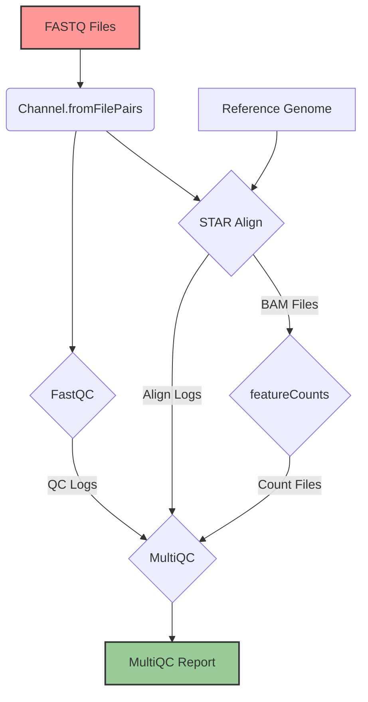
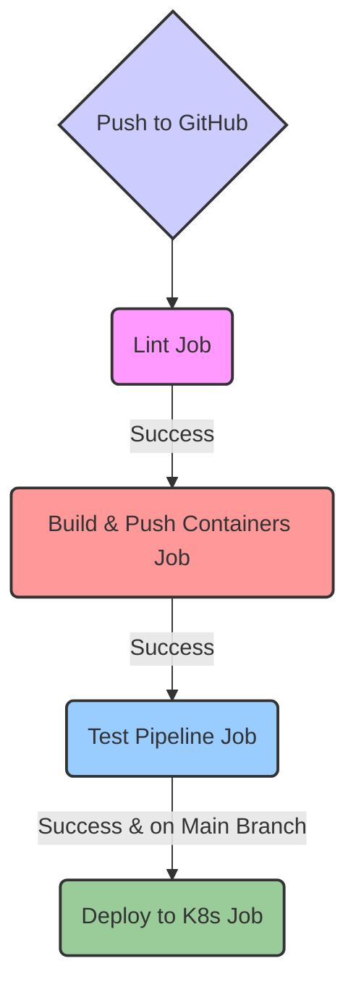

# Architecture Deep Dive: RNA-Seq Analysis Platform

This document provides a detailed overview of the architecture for the production-grade RNA-Seq analysis platform. It explains the design choices, component interactions, and data flow from a DevOps perspective.

## 🎯 Guiding Principles

The architecture was designed with the following principles in mind, which are critical in both DevOps and production bioinformatics:

-   **Reproducibility**: Every pipeline run with the same inputs must produce the exact same results. This is achieved through containerization and version pinning.
-   **Scalability**: The platform must handle a variable number of samples, from one to hundreds, without manual intervention. This is achieved through Kubernetes and Nextflow's dynamic scaling.
-   **Portability**: The pipeline should run anywhere—locally, on-prem, or on any cloud. This is achieved through Nextflow's abstraction and containerization.
-   **Fault Tolerance**: The system must be resilient to transient failures. Nextflow's resume capability and Kubernetes' self-healing allow the pipeline to recover from failed tasks.
-   **Cost-Effectiveness**: The platform should use resources efficiently. This is achieved through resource right-sizing, auto-scaling, and the use of spot instances.

---

## 🏗️ High-Level Architecture

The platform is composed of several layers, each with a specific responsibility, much like a modern web application stack.

### Architectural Diagram

```mermaid
graph TD
    subgraph User Interaction
        A[Developer/Scientist] --> B{Git Push}
    end

    subgraph CI/CD Automation
        B --> C{GitHub Actions}
        C -- 1. Lint & Test --> C
        C -- 2. Build & Push --> D[Container Registry]
    end

    subgraph Kubernetes Cluster
        E[Nextflow Head Pod] -- Manages --> F[Worker Pods]
        F -- Reads/Writes --> G[Shared Storage (PVC)]
        D -- Pulls Image --> F
    end

    subgraph Data Layer
        G -- Stores --> H[Reference Genome]
        G -- Stores --> I[Input FASTQ Files]
        G -- Stores --> J[Results]
    end

    A -- Runs Pipeline --> E

    style A fill:#f9f,stroke:#333,stroke-width:2px
    style B fill:#ccf,stroke:#333,stroke-width:2px
    style C fill:#ccf,stroke:#333,stroke-width:2px
    style D fill:#f99,stroke:#333,stroke-width:2px
    style E fill:#9cf,stroke:#333,stroke-width:2px
    style F fill:#9cf,stroke:#333,stroke-width:2px
    style G fill:#9c9,stroke:#333,stroke-width:2px
```

### Component Breakdown

| Layer | Component | DevOps Analogy | Purpose |
| :--- | :--- | :--- | :--- |
| **Source Control** | GitHub | Source Code Repository | Manages pipeline code, configurations, and documentation. |
| **CI/CD** | GitHub Actions | Jenkins / GitLab CI | Automates linting, testing, container builds, and deployment. |
| **Container Registry** | Docker Hub / ECR | Artifact Repository (Nexus/Artifactory) | Stores versioned Docker images for each bioinformatics tool. |
| **Orchestration** | Kubernetes (EKS/GKE) | Application Server / PaaS | Manages the lifecycle of all pipeline components (pods, storage). |
| **Workflow Engine** | Nextflow | Airflow / Argo Workflows | Interprets the pipeline script and translates it into a series of tasks (pods). |
| **Execution** | Ephemeral Pods | Jenkins Agents / Lambda Functions | Executes a single bioinformatics task (e.g., FastQC, STAR) in an isolated environment. |
| **Storage** | Shared PVC (EFS/Filestore) | Shared NFS / S3 Bucket | Provides a centralized, persistent location for data that can be accessed by all pods. |

---

## ⚙️ Technology Stack & Rationale

### Why Nextflow?

Nextflow is the *de facto* standard for bioinformatics workflow management.

-   **DevOps Analogy**: It's like **Airflow for bioinformatics**, but with better support for scientific computing patterns.
-   **Key Features**:
    -   **Implicit Parallelism**: Automatically runs independent tasks in parallel.
    -   **Resumability**: Can resume a failed pipeline from the last successful step, saving significant time and cost. (Like Terraform state).
    -   **Process Selectors**: Easily configure resources (CPU, memory) for specific tasks.
    -   **Executor Abstraction**: Write the pipeline once and run it on a local machine, an HPC cluster (SLURM, SGE), or Kubernetes without changing the code.

### Why Kubernetes?

Kubernetes provides the ideal environment for running containerized, resource-intensive bioinformatics pipelines.

-   **DevOps Analogy**: It's the **ultimate application server**, providing resource management, scaling, and fault tolerance.
-   **Key Benefits**:
    -   **Dynamic Scaling**: The cluster can automatically scale up nodes for demanding tasks (like STAR alignment) and scale down to zero when idle.
    -   **Resource Isolation**: Each tool runs in its own container with its own dependencies and resource limits, preventing conflicts.
    -   **Cost Optimization**: The ability to use **spot instances** for worker pods can reduce compute costs by up to 90%.
    -   **Multi-tenancy**: Multiple users or projects can share the same cluster securely using namespaces and resource quotas.

### Why a Shared `ReadWriteMany` PVC?

This is a critical architectural choice driven by the nature of genomic data.

-   **DevOps Analogy**: It's a **shared NFS mount** that all worker nodes can access simultaneously.
-   **The Problem**: A single human reference genome index is ~30 GB. If each worker pod had to download this, it would be incredibly inefficient and slow. Furthermore, the output of one stage (e.g., alignment) is the input to the next (e.g., quantification).
-   **The Solution**: A shared volume (backed by AWS EFS, GCP Filestore, etc.) allows:
    1.  The reference genome to be stored once and read by all alignment pods in parallel.
    2.  Intermediate files to be passed between pipeline stages without network transfer.
    3.  All final results to be aggregated in a single, persistent location.

| Storage Type | Access Mode | Why It Doesn't Work for This Pipeline |
| :--- | :--- | :--- |
| **EBS / GCE PD** | `ReadWriteOnce` | Only one pod can mount it at a time, preventing parallel execution. |
| **S3 / GCS** | Object Storage | Most bioinformatics tools expect a POSIX-compliant filesystem, not an object store API. |

---

## 🔄 Data Flow

The data flow through the pipeline is a Directed Acyclic Graph (DAG) managed by Nextflow.



1.  **Input Channel**: Nextflow creates a *channel* (like a message queue) from the input FASTQ files, pairing `_R1` and `_R2` files for each sample.
2.  **Parallel Execution**: This channel is fed into the `FastQC` and `STAR_ALIGN` processes. Nextflow runs one pod for each sample, up to the limits of the cluster and resource quotas.
3.  **Data Dependency**: The `featureCounts` process only starts after the `STAR_ALIGN` process for the same sample has successfully completed and produced a BAM file.
4.  **Aggregation**: The `MultiQC` process uses the `.collect()` operator, which waits for all upstream processes for all samples to finish. It then gathers all the log files and generates a single, aggregated HTML report.

---

## 🤖 CI/CD Pipeline Architecture

The CI/CD pipeline in `.github/workflows/pipeline-ci.yml` is designed to ensure code quality, reproducibility, and automation.

### CI/CD Flowchart



-   **Lint Job**: The fastest check. It validates Nextflow syntax without running any real computation. This catches typos and basic errors in seconds.
-   **Build Containers Job**: This runs in parallel for each tool using a `matrix` strategy. It ensures that all Dockerfiles are valid and pushes the resulting images to the container registry. Caching is used to speed up subsequent builds.
-   **Test Pipeline Job**: The integration test. It runs the full pipeline on a tiny test dataset using the containers built in the previous step. This verifies that all components work together correctly.
-   **Deploy Job**: This job only runs on a push to the `main` branch. It uses `kubectl` to apply the Kubernetes configurations (`namespace.yaml`, `rbac.yaml`, etc.), effectively deploying or updating the platform's infrastructure.

### Security Considerations

-   **Secrets Management**: Credentials (`DOCKER_PASSWORD`, `KUBE_CONFIG`) are stored as encrypted secrets in GitHub and are never logged.
-   **Vulnerability Scanning**: The `trivy-action` scans the built container images for known vulnerabilities (CVEs) and uploads the results to GitHub Security.
-   **Principle of Least Privilege**: The deployment job only has permissions to apply configurations. It does not have cluster-admin rights.

---

## ⚖️ Design Trade-offs

-   **Nextflow vs. Snakemake**: Snakemake is another popular workflow manager. Nextflow was chosen for its superior Kubernetes integration, larger community (especially via nf-core), and more intuitive DSL for complex, dynamic pipelines.
-   **Monolithic Container vs. Multi-Container**: We could have built a single, massive Docker image with all tools installed. The multi-container approach was chosen because:
    -   It leads to smaller, more manageable images.
    -   It allows for independent versioning of tools.
    -   It improves security by isolating dependencies.
-   **Helm vs. Kustomize vs. Plain YAML**: Plain YAML was used for simplicity and clarity in this educational project. For more complex, multi-environment deployments, **Kustomize** would be a good next step for managing environment-specific configurations without templating logic. **Helm** is better suited for distributing third-party applications rather than managing bespoke internal applications.

This architecture provides a robust, scalable, and reproducible foundation for running bioinformatics pipelines at production scale. It balances the specific needs of scientific computing with the best practices of modern DevOps.
